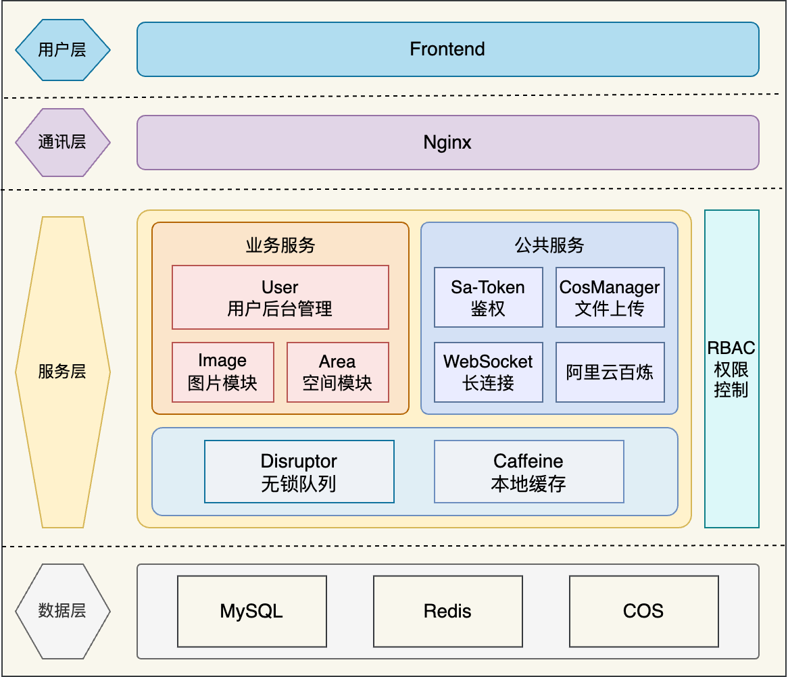

# Cloud Canvas
### 项目介绍
基于 Spring Boot + COS + WebSocket + Redis + Disruptor 的共享协作图床平台。图床划分为公共、私有及团队空间。普通用户可在公共空间浏览和上传图片，同时可将图片上传至私有空间进行编辑、AI 扩图和批量管理。企业用户可邀请成员加入团队空间，实时协作编辑并共享图片。管理员可在后台审核和管理图片，并支持对空间使用数据进行可视化分析。

### 项目架构

### 主要工作
1. 基于 Sa-Token 实现多账号体系的 RBAC 权限控制，并通过自定义注解支持方法级细粒度控制，实现鉴权逻辑与业务代码解耦；
2. 为优化主页图片的查询性能，使用 Redis 和 Caffeine 构建高性能多级缓存，接口平均响应时长从 268 ms 降低到 48 ms；
3. 为节约储存成本和加快加载速度，在图片文件上传前将转码压缩为 Webp 并生成缩略图，相较于原文件体积缩小约 30%，页面加载速度提升 10%；
4. 基于 WebSocket 和事件驱动设计实现多人协作编辑图片功能，通过自定义 WebSocket 握手拦截器确保连接安全性；
5. 为优化协作编辑体验，使用 Disruptor 无锁队列实现异步处理 WebSocket 消息，大幅提升系统吞吐量至 20000+ QPS，并支持优雅停机机制，防止消息丢失。